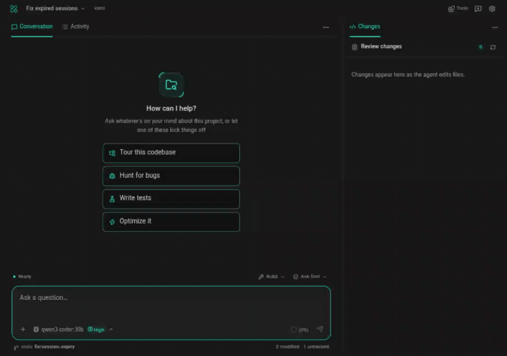

# Xratu

<p align="center">
  
</p>

<p align="center">
  <a href="#xratu">English</a> ·
  <a href="README.fa.md">فارسی</a>
</p>

<p align="center">
  <a href="https://github.com/thesamehosuh/xratu/actions/workflows/ci.yml"></a>
  <a href="LICENSE"></a>
  
</p>

Open-source AI coding agent for VS Code. Bring your own key or use a local
runtime. Everything runs inside the extension host, on your machine.

<p align="center">
  
</p>

## Your keys. Your models. Your machine.

- API keys live in VS Code secrets storage and go only to the endpoint you
  configure.
- Fully offline capable: Ollama, LM Studio, vLLM, and llama.cpp are
  auto-discovered on your machine.

## Features

- **Work surface** - Conversation, Changes, and Activity share one compact
  composer. Finished tool calls fold into optional steps; Activity keeps the
  full outputs in a read-only view, with timestamps in expanded footers and
  on hover. Approvals and questions stay in Conversation. Review checkpoint
  diffs inline, mark files reviewed, and add feedback to your draft before
  sending. Wide panels show Changes alongside
  the conversation by default. Drag Activity, Changes, Agents, or Background between the main
  tabs and sidebar, or use the tab menu. Placement and sidebar width are
  remembered; narrow windows keep every view in the main tabs. Drag the
  divider or use its arrow keys to resize.
- **Sidebar pages** - providers, MCP servers, marketplace, skills, agent
  files, usage, proxy, and settings stay one click away. Setup opens in a
  focused side panel; Iranian providers remain visible. Drafts survive page
  changes, and user bubbles stay on the right with automatic text direction.
- **Agentic coding** - reads files, edits code, runs terminal commands,
  searches the web. Every edit and command needs your approval; per-tool
  auto-approve if you trust a workflow, YOLO mode if you don't want the gate.
  **YOLO mode drops the approval gate entirely** - file edits, terminal
  commands, and MCP tools all run unasked. Checkpoints still snapshot before
  edits and plan mode still blocks mutations, but nothing is holding the loop
  back. Point it at a scratch workspace, not a repo you care about.
- **Plan mode** - read-only planning with a task list. Mutating tools are
  blocked in code, not by prompt.
- **Checkpoints** - shadow-git snapshots before sends and edits. Use a turn's
  **Review changes** button or **Changes** to inspect files inline and open
  the full native diff. Restore a snapshot from the Command Palette with
  **Xratu: Restore Checkpoint…**. Your real git repo is never touched.
- **MCP servers** - stdio, WebSocket, or streamable HTTP/SSE, with
  Cline-compatible files-based config.
- **Agent Skills** - the open [agentskills.io](https://agentskills.io)
  standard; skills can be shared with Claude Code, Roo Code, OpenCode, and
  others.
- **Subagents** - delegate a self-contained task to a named agent profile
  running in its own context; several can run at once. See
  [Subagents](#subagents).
- **Long sessions** - steer mid-task, edit & resend any message, image and
  PDF attachments, automatic context compaction.
- **Proxy-aware** - follows your proxy settings, VS Code's, the environment,
  or the OS system proxy; a scan finds the Clash/v2rayN client already
  running on your machine. Per-MCP routing (auto / via proxy / direct).
- **Persian-first** - fa UI, Jalali dates, Persian error explanations, and
  colloquial Farsi replies when you ask for them.

## Models

| Group | Providers |
|-------|-----------|
| Cloud | OpenAI, Google Gemini, OpenRouter, xAI, Groq, DeepSeek, Mistral, Perplexity, Cohere, Together, Fireworks, Cerebras, NVIDIA NIM, Hugging Face, SambaNova, Moonshot, Z.AI, OpenCode Zen |
| Iranian | Kaya AI, Avalai, Metis AI, Liara AI, ArvanCloud AI, Navaan, GapGPT |
| Local | Ollama, LM Studio, vLLM, llama.cpp |
| Custom | Any OpenAI-compatible HTTPS endpoint |

## For developers in Iran

- **Iranian gateways as first-class presets** - Kaya AI, Avalai, Metis AI,
  Liara AI, ArvanCloud AI, Navaan, and GapGPT sit in their own group in
  Settings → Providers, take rial payment, and need no VPN. Usage costs show
  in Toman on the Usage page.
- **Fully local is fully offline** - a local runtime (Ollama, LM Studio,
  vLLM, llama.cpp) makes the agent complete with zero network dependency.
- **Proxy-native** - Iranian setups route through Clash/v2rayN "System
  Proxy" mode; Xratu picks it up (no TUN needed), scans for the local
  client and its ports, and routes MCP traffic per server.
- **Persian in, Persian out** - fa UI, Jalali dates, Persian error
  explanations, and with reply language set to Persian the agent writes
  colloquial Farsi - the bundled `natural-farsi` skill is preloaded, so the
  register holds from the first token.
- **No circumvention advice** - when an endpoint is unreachable or a signup
  fails, the agent maps working alternatives (domestic gateways, local
  models, Iranian PaaS) instead of VPN guides.

### Provider endpoints

| Provider | Base URL | Notes |
|----------|----------|-------|
| Kaya AI | `https://kayaai.ir/api` | preset ships the endpoint |
| Avalai | `https://api.avalai.ir/v1` | preset ships the endpoint |
| GapGPT | `https://api.gapgpt.app/v1` | preset ships the endpoint |
| Metis AI | per-service | paste the endpoint from your service page |
| Liara AI | per-service | each AI service has its own URL |
| ArvanCloud AI | per-service | paste the endpoint from your service page |
| Navaan | per-service | paste the endpoint from your service page |

All speak the OpenAI-compatible API. The first three work with nothing but
the API key; the rest hand each service its own URL at signup.

### Sign in with a ChatGPT subscription

Open **Providers**, choose **Add connection**, then **Continue with ChatGPT**. Xratu
uses OpenAI's [documented open-source sign-in integration](https://developers.openai.com/siwc/token-sharing-open-source/sign-in),
registers Xratu for your account and workspace, and validates the signed ID
token before saving the connection. ChatGPT plan access must be granted during
consent; identity sign-in alone does not enable inference.

Use **Copy link** to open sign-in in your preferred browser. Browser login
starts a callback listener on `127.0.0.1`, trying another port when one is
occupied. If the browser cannot reach the extension host (for example over SSH
or in a container), expand **Browser didn’t connect?** and paste the
**complete redirect URL**. It carries the state and issued client ID needed to validate a new
registration. The documented integration currently uses browser sign-in.

Each account/workspace registration has its own credentials in VS Code
SecretStorage. Add or select accounts in Connections; signing in again reuses
that registration's issued client ID and the host's persistent ID. Sign-out
removes its access, refresh, and ID tokens while retaining the account/client
mapping for a later sign-in.

Model discovery and inference use the public `https://api.openai.com/v1`
endpoints, with streaming Responses requests and `store: false`. Model names,
ordering, context windows, and reasoning options come from the signed-in
account's catalog. The legacy Codex public client and ChatGPT backend endpoints
are no longer used; connections made by that earlier implementation need a
fresh sign-in.

**Usage** shows ChatGPT plan tokens recorded in Xratu over the last 30 days,
with a per-model breakdown and **Manage usage** linking to ChatGPT settings for
plan limits and credits. Plan requests are kept separate from API-key spend and
are never assigned API prices, including after a rate edit.

Tokens refresh five minutes early and on an authentication rejection. A
temporary renewal failure can keep a still-valid token; a permanent rejection
requires sign-in again. Requests and refresh waiting honor Stop and the
configured proxy. Sign-out attempts server revocation before clearing locally;
if revocation cannot be confirmed, Xratu reports it so you can disconnect the
app in ChatGPT settings.


## Getting started

Install from the VS Code Marketplace:
[xratu.xratu](https://marketplace.visualstudio.com/items?itemName=xratu.xratu)

Prefer a manual install? Grab the latest `xratu-*.vsix` from
[Releases](https://github.com/thesamehosuh/xratu/releases) and install it
via **Code → Extensions → ⋯ → Install from VSIX…**

1. Open the Xratu panel from the activity bar.
2. Pick a preset or a local runtime, paste your API key, choose a model.
3. Chat. Approve edits and commands as the agent works - or turn on
   auto-approval once you trust the loop.

## MCP servers

Xratu reads server config from two files:

- **Global**: `mcp.json` in the extension's global storage
- **Workspace**: `.xratu/mcp.json` in the workspace root (overrides global
  per server key)

Format is Cline-compatible: `command`/`args`/`env` for stdio, `url` for
remote. Tools surface to the agent as `mcp__<server>__<tool>` and follow the
same approval flow as built-ins.

### Marketplace

The MCP page also has a **Marketplace** tab, so you are not limited to servers
you type in by hand:

- **Sources** are configurable (`xratu.mcpMarketplaceSources`). Defaults are the
  public catalog published by the Cline project (Apache-2.0) and the official
  MCP registry; any http(s) catalog URL works, and an empty list turns remote
  catalogs off.
- Catalogs are fetched **host-side, through your proxy**, cached for 24 hours,
  and always merged with a curated list that ships inside the extension, so the
  tab keeps working offline.
- Adding is **never silent**: the row shows the exact command or URL, and the
  confirm step shows the config that will be written. Entries that need a
  credential open the edit form instead. Tool auto-approval is never taken from
  a catalog.
- An entry a catalog ships without install metadata can be resolved from its
  README on request; anything guessed that way is labelled and reviewed before
  it is saved.

## Agent Skills

A skill is a folder with a `SKILL.md` file - YAML frontmatter
(`name` + `description`) plus a markdown body. Only the name/description
load up front; the agent pulls in the rest via its `skill` tool when your
request matches. Search order (first match wins):

- `.xratu/skills/<name>/SKILL.md`
- `.agents/skills/<name>/SKILL.md` (shared with other agent tools)
- `.claude/skills/<name>/SKILL.md` (Claude Code)
- `~/.agents/skills/<name>/SKILL.md`
- `~/.claude/skills/<name>/SKILL.md` (Claude Code)

```markdown
---
name: deploy-staging
description: Deploy the app to staging; use when the user asks to deploy or ship to staging.
---

1. Run the test suite
2. Build the app
3. `npm run deploy:staging`
```

Extra files (scripts, references, templates) go next to the `SKILL.md`.
Enable/disable skills in Settings → Servers & skills → Skills.

### First-party skills

Xratu ships six skills, seeded to `~/.agents/skills` on first run (so
Claude Code, OpenCode, and the other agent tools see them too), editable
like any skill, and switchable per skill in Settings → Servers & skills →
Skills:

| Skill | What it does |
|-------|--------------|
| `natural-farsi` | Writes Persian the way Iranian developers actually type - colloquial register (رو not را), no half-spaces, technical terms left in English. Preloaded automatically when reply language is Persian. |
| `finglish-normalize` | Reads Finglish (Persian in Latin script) as Persian and matches the reply language and script to you. |
| `jalali-dates` | Jalali (Shamsi) dates in prose; machine-readable dates stay ISO. |
| `iran-dev-access` | What works from Iran and what to use instead - domestic gateways, local models, Iranian PaaS. |
| `iran-connectivity-fallback` | A provider timing out repeatedly? Offers the alternatives already configured on your machine - no circumvention guides. |
| `local-llm-low-ram` | Honest sizing math for running models locally on small machines. |

## Subagents

A subagent is a named agent profile the main agent can hand a
self-contained task to with the `task` tool. The subagent runs a full agent
loop in a **fresh context** - it cannot see your conversation - and only its
final report comes back. That keeps a long search or a multi-file sweep out
of your chat window, and lets the parent keep working while it runs.

Two profiles are built in:

| Profile | What it is for |
|---------|----------------|
| `explore` | Research. Reads, searches, and runs **read-only commands** (build, type-check, tests, linters, `git log`) to verify what it reports. It has no editing tools, so it cannot change anything. |
| `general` | Multi-step work: inspect, edit, run commands, verify. |

When the model needs several delegations in one message they run
concurrently - `xratu.maxParallelSubagents` (default 4) caps how many at
once, because each one is a whole agent loop with its own context and budget.
Exceeding the cap is not an error: the rest start in order as slots free up.

### Watching delegated work

The **Agents** tab appears when a task is delegated. Pick a run to see its
Conversation or tool-only Activity, actual model and effort, elapsed time,
and reported token usage. Expand tools for file content with line numbers,
search matches, terminal output, diffs, and complete arguments. The task pill's
**Observe run** button opens that same run. Agents can move to the sidebar
alongside the parent conversation; switching runs preserves opened details.

Child approvals identify their profile and task in Conversation. The child
view stays read-only and links back to the real approval card. Queued tasks,
waiting approvals, failures, and interruptions have distinct states. Saved
sessions retain bounded text traces (120 entries / 48,000 characters per run);
older run detail is reclaimed when the session trace budget fills. Unfinished
restored runs show as interrupted. Older sessions keep their
original reports. Only the final report enters the parent's model context.

Background processes have a movable **Background** tab with live output,
per-process stop controls, elapsed time, and recent exit results. Log following
pauses when you scroll up. Output keeps streaming after the agent finishes;
processes recovered after a VS Code reload show when their output pipe is gone.

### Writing an agent file

Run **Xratu: Agent Files** from the command palette to see every profile
Xratu loaded - including the ones that failed and why - and to scaffold a new
one. Files are plain markdown with YAML frontmatter; the body is the
subagent's system prompt. Search order (first match wins):

- `.xratu/agents/<name>.md`
- `.agents/agents/<name>.md` (shared with other agent tools)
- `.claude/agents/<name>.md` (Claude Code)
- `~/.agents/agents/<name>.md`
- `~/.claude/agents/<name>.md` (Claude Code)

```markdown
---
name: code-reviewer
description: Reviews changed code for correctness and security; use after a large edit.
tools: read_file, grep_search, glob_search, run_terminal_command
model: gpt-5-mini
reasoning_effort: low
max_rounds: 30
---

Review the diff for correctness and security problems. Report each finding
with a file path and line number, most severe first.
```

| Field | Meaning |
|-------|---------|
| `name` | Optional; must match the file name (lowercase, digits, single hyphens). |
| `description` | **Required.** When to delegate to this agent - the model picks profiles from this line. |
| `tools` | Optional allow-list of tool names. Omit it for everything except `task` and `ask_user_question`, which a subagent never gets. |
| `model` | Optional. Run this profile on a specific model (its context window and output cap follow that model). Default: the parent session's model. |
| `reasoning_effort` | Optional: `none`, `minimal`, `low`, `medium`, `high`, `xhigh`, `max`. |
| `max_rounds` | Optional loop budget for this profile (default 50). |

`tools:` names are checked against the tools your install actually has when
the file loads. Names that do not exist are dropped with a warning, and a
list where **none** of the names exist is a hard error rather than a
subagent that silently cannot do anything - worth knowing, because agent
files written for other tools spell them `Read`, `Grep`, `Bash`. Run
**Xratu: Agent Files** (or look in the **Xratu** output channel) to see
these.

A subagent keeps its own context, cannot delegate further, cannot ask you
anything mid-run, and its own edits and commands go through the same
approval gate as yours. Its run is reported back with a `task_id`: pass that
id back in a later `task` call to continue the same subagent with its
context intact instead of restarting the work. A `task_id` lives as long as
the chat stays open in the same VS Code window - reloading the window ends
it.

## Proxy

Settings → Proxy controls outbound routing:

- **Modes** - `auto` (Xratu setting → VS Code → environment → OS system
  proxy), `custom` (one explicit proxy URL plus a no-proxy list), or `off`.
- **Local client scan** - finds the Clash family (Clash Verge Rev, mihomo,
  Mihomo Party, Clash Nyanpasu, ClashX), v2rayN/v2rayA, or Surge already
  running on your machine and locks to its ports. "System Proxy" mode is
  enough - no TUN required.
- **Per-MCP routing** - each MCP server can ride auto / via proxy /
  direct, with a live connection test before you commit.
- MCP marketplace catalogs are fetched host-side through the same proxy and
  cached for 24 hours.

## Privacy

API keys are stored in VS Code secrets storage and sent only to the endpoint
you configure. Chat history and checkpoints live on your disk only.

Two features do leave your machine, by design:

- **Web search** sends the query to whichever provider is configured - your own
  SearXNG instance (`xratu.webSearchUrl`), otherwise Brave Search; Parallel is
  also selectable.
- **Fetch URL** requests the page you or the agent name, after the SSRF guard
  rejects private and loopback addresses.

MCP servers, skills, and agent files are read from your disk. There is no
telemetry, no analytics, and no crash reporting in the extension. Report a
vulnerability through [SECURITY.md](SECURITY.md), not a public issue.

## Development

```bash
npm ci
npm run compile        # host bundle (esbuild) + webview (vite)
npm run test:webview
```

CI type-checks host and webview separately and runs the test suites on
Ubuntu, Windows, and macOS. See [AGENTS.md](AGENTS.md) for details.

## Contributing

Issues and PRs welcome. Open an issue before large changes. Conventional
Commits, CI green, and code review required for every PR.

### Local setup and connection comparison

Settings now includes **Offline mode** and **Explain errors**. Offline mode limits Xratu-managed HTTP requests to loopback, disables web/external MCP tools, and cancels active operations when enabled. Terminal subprocesses remain unrestricted. A persistent banner links to the bundled [offline setup and hardware guide](assets/guides/offline.en.md), which is also available from Providers and ships in the VSIX.

In **Providers**, expand **Manage Ollama models** for a discovered Ollama runtime on port 11434: download with progress/cancel, or delete after confirmation. Other runtimes manage weights in their own apps. The guide covers quantization, RAM/VRAM sizing and offline troubleshooting.

Iranian presets link to official onboarding pages. The bundled [provider comparison](assets/guides/providers.en.md) separates verified pricing/payment information from unverified tariffs. **Compare connection latency** sends a small, opt-in request to the active model and shows first-text-token time, total time, and known rates/estimated cost. No project context is sent; requests may incur charges. Compare the same model across connections and repeat measurements instead of treating a single sample as a ranking.

Marketplace visual regressions are CI-gated on Linux for fa/en at 420px/900px, including catalog, confirmation and offline states. Baselines use the bundled font and lockfile-pinned Chromium; the same layout checks run on Windows and macOS. To deliberately update them, review the generated images after running `XRATU_VISUAL=1 npx playwright test -c test/e2e/playwright.config.ts marketplace.spec.ts --grep 'visual contract' --update-snapshots` on Linux.

## License

[Apache-2.0](LICENSE)
